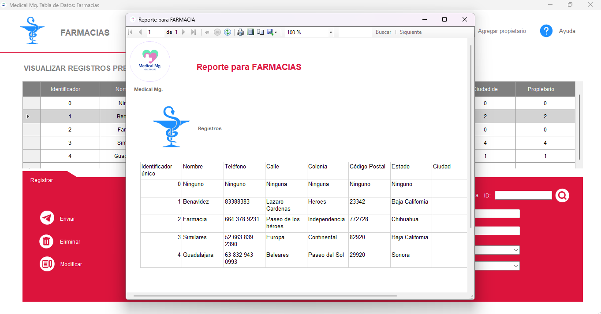
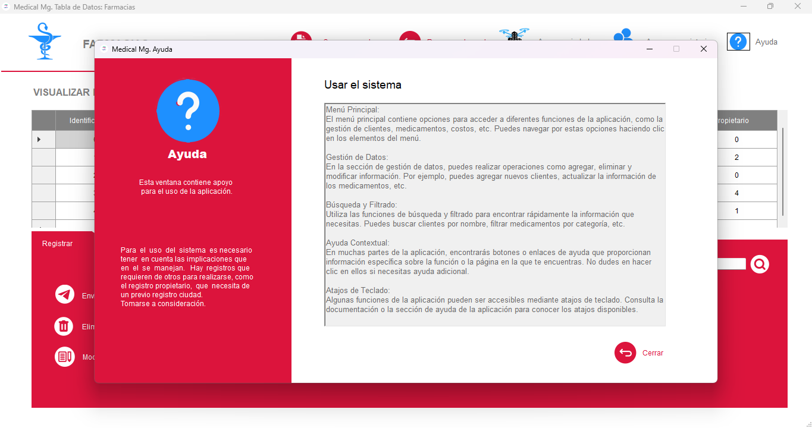

# Sistema Administrador de Farmacias

Este sistema es una **aplicación de escritorio** diseñada para la administración de franquicias farmacéuticas, proporcionando herramientas para **facturación**, **acceso a bases de datos** y más. Está desarrollada en **C#** y utiliza tecnologías como **SQL Server** y **ReportViewer**.

---

## 🌟 **Características Principales**
-  Gestión de ventas y facturación.
-  Acceso y manipulación de bases de datos de productos, clientes y empleados.
-  Generación de reportes con uso de **ReportViewer**.
-  Documentación de ayuda integrada.

---

##  **Vista Previa de la Aplicación**
### **Interfaz Principal**
La apariencia principal del sistema es la siguiente:


### **Generación de Reportes**
Incluye una funcionalidad para la creación de reportes:



### **Menú de Ayuda**
Un menú para guiar al usuario en el uso del sistema:



---

##  **Requisitos del Sistema**
- **Sistema Operativo**: Windows 10 o superior.
- **Framework**: .NET Framework 4.7.2 o superior.
- **Base de Datos**: SQL Server 2019 o superior.
- **Herramientas adicionales**: 
  - Microsoft ReportViewer.

---

## 🚀 **Instalación**
1. Clona este repositorio:
   ```bash
   git clone https://github.com/tu-usuario/sistema-administrador-farmacias.git
